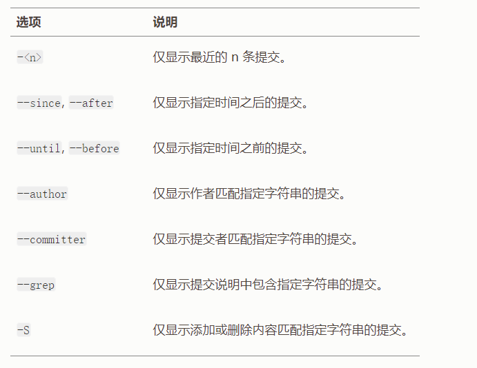

# Git

## 获取Git仓库

### git init  

将创建一个名为 .git 的子目录，这个子目录含有你初始化的 Git 仓库中所有的必须文件，这些文件是 Git 仓库的骨干。

### git clone [仓库地址]  

获得一份已经存在了的 Git 仓库的拷贝.

## 记录更新到仓库

### 检查当前文件状态  

用 git status 命令查看哪些文件处于什么状态

### 跟踪新文件

### 暂存已修改的文件  

(git add [files])跟踪新添加的文件或者当已跟踪的文件发生修改时将其修改暂存。

### 状态简览  

git status 命令的输出十分详细，使用（git status -s/-short）可以帮你缩短状态命令的输出，这样可以以简洁的方式查看更改。

### 忽略文件  

本地目录下有些文件无需纳入git管理，通常是一些log日志文件，临时文件。git管理下的文件夹通常会有.gitignore文件，里面的内容写入了我们不希望纳入git管理的文件名称/路径。
:::tip 提示
    在最简单的情况下，一个仓库可能只根目录下有一个.gitignore 文件，  
    它递归地应用到整个仓库中。然而，子目录下也可以有额外的.gitignore 文件。
:::

### 查看已暂存和未暂存的修改  

使用git diff查看尚未暂存的文件更新了哪些部分。此命令比较的是工作目录中当前文件和暂存区域快照之间的差异。  
若要查看已暂存的将要添加到下次提交里的内容，可以用 git diff --staged/--cached 命令。这条命令将比对已暂存文件与最后一次提交的文件差异。  
另外可以使用git diff HEAD显示工作目录(已track但未add文件)和暂存区(已add但未commit文件)与最后一次commit之间的的所有不相同文件的增删改。

### 提交更新  

git commit将已经放入暂存区的文件提交提交至本地仓库。记住，提交时记录的是放在暂存区域的快照。任何还未暂存文件的仍然保持已修改状态，可以在下次提交时纳入版本管理。

### 跳过使用暂存区域  

git commit -a，会自动把所有已追踪过的文件暂存下来一并提交，从而跳过git add步骤。

### 移除文件  

要从 Git 中移除某个文件，就必须要从已跟踪文件清单中移除（确切地说，是从暂存区域移除），然后提交。 可以用 git rm 命令完成此项工作，并连带从工作目录中删除指定的文件，这样以后就不会出现在未跟踪文件清单中了。如果简单的从工作目录中手工删除文件，使用git status命令仍会出现。此时使用git rm记录此次移除文件的操作，就会不再纳入版本管理。
或者你需要把文件从git中删除但仍保留在本地仓库中,换而言之就是你不想要git继续追踪该文件。使用git rm --cached [files]

### 移动文件  

运行 git mv 就相当于运行了下面三条命令：

``` sh
mv README.md README
git rm README.md
git add README
```

### 查看提交历史

**git log** 不传入任何参数的默认情况下，git log 会按时间先后顺序列出所有的提交，最近的更新排在最上面。

1. -p/--patch  
    显示每次提交所引入的差异（按补丁的格式输出）。

2. --stat  
    想看到每次提交的简略统计信息，可以使用 --stat 选项：

3. --pretty
    有许多内置的子选项，如git log --pretty=online/short/full/fuller，它们展示信息的格式一致，但是详尽程度不一。  
    format子选项可以定制记录的显示格式。

- 限制输出长度  
    
