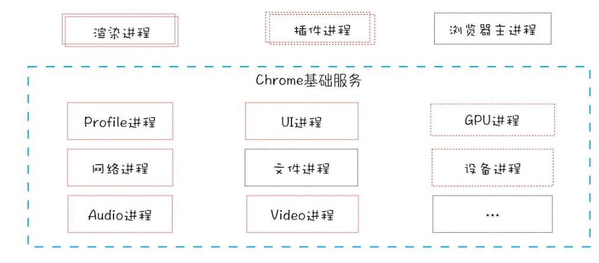

# 数据库

## 关系型数据库

关系型数据库特点：

1. 存储方式：传统的关系型数据库采用表格的储存方式，数据以行和列的方式进行存储，要读取和查询都十分方便。

2. 存储结构：关系型数据库按照结构化的方法存储数据，每个数据表都必须对各个字段定义好（也就是先定义好表的结构），再根据表的结构存入数据，这样做的好处就是由于数据的形式和内容在存入数据之前就已经定义好了，所以整个数据表的可靠性和稳定性都比较高，但带来的问题就是一旦存入数据后，如果需要修改数据表的结构就会十分困难。

3. 存储规范：关系型数据库为了避免重复、规范化数据以及充分利用好存储空间，把数据按照最小关系表的形式进行存储，这样数据管理的就可以变得很清晰、一目了然，当然这主要是一张数据表的情况。如果是多张表情况就不一样了，由于数据涉及到多张数据表，数据表之间存在着复杂的关系，随着数据表数量的增加，数据管理会越来越复杂。

4. 扩展方式：由于关系型数据库将数据存储在数据表中，数据操作的瓶颈出现在多张数据表的操作中，而且数据表越多这个问题越严重，如果要缓解这个问题，只能提高处理能力，也就是选择速度更快性能更高的计算机，这样的方法虽然可以一定的拓展空间，但这样的拓展空间一定有非常有限的，也就是关系型数据库只具备纵向扩展能力。

5. 查询方式：关系型数据库采用结构化查询语言（即SQL）来对数据库进行查询，SQL早已获得了各个数据库厂商的支持，成为数据库行业的标准，它能够支持数据库的CRUD（增加，查询，更新，删除）操作，具有非常强大的功能，SQL可以采用类似索引的方法来加快查询操作。

6. 规范化：在数据库的设计开发过程中开发人员通常会面对同时需要对一个或者多个数据实体（包括数组、列表和嵌套数据）进行操作，这样在关系型数据库中，一个数据实体一般首先要分割成多个部分，然后再对分割的部分进行规范化，规范化以后再分别存入到多张关系型数据表中，这是一个复杂的过程。好消息是随着软件技术的发展，相当多的软件开发平台都提供一些简单的解决方法，例如，可以利用ORM层（也就是对象关系映射）来将数据库中对象模型映射到基于SQL的关系型数据库中去以及进行不同类型系统的数据之间的转换。

7. 事务性：关系型数据库强调ACID规则（原子性（Atomicity）、一致性（Consistency）、隔离性（Isolation）、持久性（Durability）），可以满足对事务性要求较高或者需要进行复杂数据查询的数据操作，而且可以充分满足数据库操作的高性能和操作稳定性的要求。并且关系型数据库十分强调数据的强一致性，对于事务的操作有很好的支持。关系型数据库可以控制事务原子性细粒度，并且一旦操作有误或者有需要，可以马上回滚事务。

8. 读写性能：关系型数据库十分强调数据的一致性，并为此降低读写性能付出了巨大的代价，虽然关系型数据库存储数据和处理数据的可靠性很不错，但一旦面对海量数据的处理的时候效率就会变得很差，特别是遇到高并发读写的时候性能就会下降的非常厉害。

9. 授权方式：关系型数据库常见的有Oracle，SQLServer，DB2，Mysql，除了Mysql大多数的关系型数据库如果要使用都需要支付一笔价格高昂的费用，即使是免费的Mysql性能也受到了诸多的限制。

## 非关系型数据库

非关系型数据库的实质：非关系型数据库产品是传统关系型数据库的功能阉割版本，通过减少用不到或很少用的功能，来大幅度提高产品性能。

非关系型数据库特点：

对于NoSQL并没有一个明确的范围和定义，但是他们都普遍存在下面一些共同特征：

1. 易扩展：NoSQL数据库种类繁多，但是一个共同的特点都是去掉关系数据库的关系型特性。数据之间无关系，这样就非常容易扩展。无形之间，在架构的层面上带来了可扩展的能力。[

2. 大数据量，高性能：NoSQL数据库都具有非常高的读写性能，尤其在大数据量下，同样表现优秀。这得益于它的无关系性，数据库的结构简单。一般MySQL使用Query Cache。NoSQL的Cache是记录级的，是一种细粒度的Cache，所以NoSQL在这个层面上来说性能就要高很多。

3. 灵活的数据模型：NoSQL无须事先为要存储的数据建立字段，随时可以存储自定义的数据格式。而在关系数据库里，增删字段是一件非常麻烦的事情。如果是非常大数据量的表，增加字段简直就是——个噩梦。这点在大数据量的Web 2.0时代尤其明显。

4. 高可用：NoSQL在不太影响性能的情况，就可以方便地实现高可用的架构。比如Cassandra、HBase模型，通过复制模型也能实现高可用。

## 两种数据库比较

1. 成本:Nosql数据库很容易部署，基本上是开源软件，无需像Oracle那样花费大量成本购买，比关系数据库便宜。

2. 查询速度:Nosql数据库将数据存储在高速缓存中，不需要对SQL层进行分析。关系数据库在硬盘上存储数据，自然的查询速度远比Nosql数据库慢。

3. 存储数据的格式：Nosql的存储格式是key,value形式、文档形式、图片形式等等，所以可以存储基础类型以及对象或者是集合等各种格式，而数据库则只支持基础类型。

4. 扩展性：关系型数据库有类似join这样的多表查询机制的限制导致扩展很艰难。Nosql基于键值对，数据之间没有耦合性，所以非常容易水平扩展。

5. 持久存储：Nosql不适用于持久存储，海量数据的持久存储，还是需要关系型数据库

6. 数据一致性：非关系数据库通常强调数据的最终一致性，而不是像关系数据库那样强烈的数据一致性，以及从非关系数据库读取的数据可能仍处于中间状态，Nosql不提供对事务的处理。

::: tip 出处
以上三点均来源于华为云社区<https://www.huaweicloud.com/zhishi/1592288147096.html>
:::

## 数据库范式

### 数据库范式的作用

数据库范式主要是为解决关系数据库中数据冗余、更新异常、插入异常、删除异常问题而引入的设计理念。简单来说，数据库范式可以避免数据冗余，减少数据库的存储空间，并且减轻维护数据完整性的成本。是关系数据库核心的技术之一，也是从事数据库开发人员必备知识。

### 数据库范式分类介绍

范式是评价数据库模式规范化程度从低到高主要有：1NF、2NF、3Nf、BCNF、4NF、5NF。

#### 1NF 第一范式（不可拆分）

强调属性的原子性约束，要求**属性具有原子性，不可再分解**。

举例：

学生表(学号、姓名、年龄、性别、地址)。**地址可以细分为国家、省份、城市、市区、街道，那么该模式就没有达到第一范式**。

第一范式存在问题：冗余度大、会引起修改操作的不一致性、数据插入异常、数据删除异常。

#### 2NF 第二范式（值必须完全依赖全部主键）

第二范式，强调记录的唯一性约束，数据表必须有一个主键，并且没有包含在主键中的列必须完全依赖于主键，而**不能只依赖于主键的一部分**。

举例：

版本表(版本编码，版本名称，产品编码，产品名称)，其中主键是(版本编码，产品编码)，这个场景中，数据库设计并不符合第二范式，**因为产品名称只依赖于产品编码,存在部分依赖。**所以，为了使其满足第二范式，可以改造成两个表：版本表(版本编码，产品编码)和产品表(产品编码，产品名称)

#### 3NF 第三范式（消除部分依赖和传递依赖）

第三范式，强调数据属性冗余性的约束，也就是非主键列必须**直接依赖于主键**。也就是消除了非主属性对码的传递函数依赖。

举例：

订单表(订单编码，顾客编码，顾客名称)，其中主键是(订单编码)，这个场景中，顾客编码、顾客名称都完全依赖于主键，因此符合第二范式，但顾客名称依赖于顾客编码，从而**间接依赖于主键，所以不能满足第三范式**。如果要满足第三范式，需要拆分为两个表：订单表(订单编码，顾客编码)和顾客表(顾客编码，顾客名称)。

说明：3NF的模式肯定满足2NF。产生冗余和异常的两个重要原因是部分依赖和传递依赖。3NF模式中不存在非主属性对码的部分函数依赖和传递函数依赖，性能较好。1NF、2NF一般不适合作为数据库模式，通常需要转换为3NF或者更高级别的范式，这种变换过程称为关系模式规范化处理。

#### BCNF(Bovce Codd Normal Form 巴克斯范式)（消除主键间的依赖）

属于修正的第三范式，是**防止主键的某一列会依赖于主键的其他列**。当3NF消除了主属性对码的部分函数依赖和传递函数依赖称为BCNF。

特性：

1、所有主属性对每一个码都是完全函数依赖pp

2、所有主属性对每一个不包含它的码，也是完全函数依赖

3、没有任何属性完全函数依赖与非码的任何一组属性

举例：库存表(仓库名，管理员名，商品名，数量)，主键为(仓库名，管理员名，商品名)，这是满足前面三个范式的，但是仓库名和管理员名之间存在依赖关系，因此删除某一个仓库，会导致管理员也被删除，这样就不满足BCNF。

#### 4NF 第四范式（消除多值依赖）

非主属性不应该有多值。如果有多值就违反了第四范式。4NF是限制关系模式的属性间不允许有非平凡且非函数依赖的多值依赖。

举例：用户联系方式表(用户id，固定电话，移动电话)，其中用户id是主键，这个满足了BCNF,但是**一个用户有可能会有多个固定电话或者多个移动电话，那么这种设计就不合理，应该改为(用户id，联系方式类型，电话号码)。**

说明：如果只考虑函数依赖，关系模式规范化程度最高的范式是BCNF;如果考虑多值依赖则是4NF。

#### 5NF 第五范式

第五范式属于最终范式，消除了4NF中的连接依赖，第五范式需要满足以下要求：

1、必须满足第四范式

2、表必须可以分解为较小的表，除非那些表在逻辑上拥有与原始表相同的主键。

一般实际应用中不必考虑第五范式。

:::tip 范式来源
范式介绍来源于今日头条<https://www.51cto.com/article/632448.html>
:::

## 浏览器

### 多进程架构

Chrome 最终要把 UI、数据库、文件、设备、网络等模块重构为基础服务，类似操作系统底层服务，下面是 Chrome“面向服务的架构”的进程模型图

### 渲染页面：浏览器的工作原理

详细看MDN<https://developer.mozilla.org/zh-CN/docs/Web/Performance/How_browsers_work>

## XSS和 CSRF攻击详解

跨站脚本攻击（Cross Site Scripting)，为了不和层叠样式表 CSS 混淆，故将跨站脚本攻击缩写为 XSS)。恶意攻击者往 Web 页面里插入恶意 Script 代码，当用户浏览该页之时，嵌入其中 Web 里面的 Script 代码会被执行，从而达到恶意攻击用户的目的。
